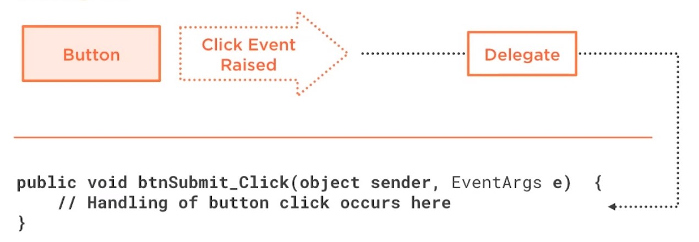

# Events, Delegates and Lambdas

Sugestão: leia o tópico Delegates.

## Conceitos 

### Events

Evento é uma notificação gerada por um event raiser e escutada por múltiplos *subscribeds events handlers*, que carrega consigo uma informação (EventArgs).

### Delegates

Delegates são pipelines que permitem a emissão de um evento alcançar o events handlers que consumirão os EventArgs. São classes frequentemente chamadas de function pointers e são baseadas em uma base class MultiCastDelegate.

### Event Handler

O EventHandler é um méto do que recebe e processa o dado recebido do delegate. Geralmente recebe dois parametros, sender e eventArgs. Sender é um objeto do tipo object que contém informações do emissor do evento. EventArgs é um objeto que encapsula os dados que devem ser recebidos e processados.
